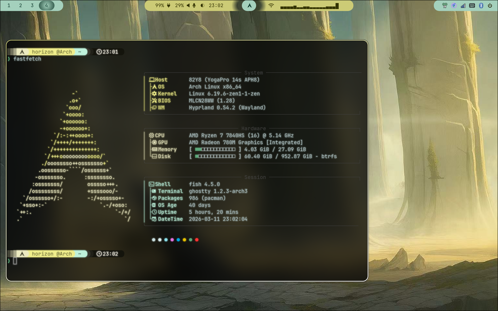
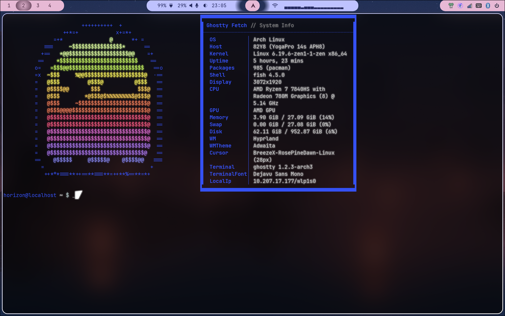

# My Arch Linux Dotfiles
Welcome to Horizon's archlinux repository, 
a place saving personal configuration of my operating system. 
Here's a brief overview of what you will find in the listing directory:

## Hyprland

`Hyprland` recently added scrolling layouts, which is nice to laptop users. A shell script `toggle_latout.sh` can switch the layouts between `Dwindle` and `Scrolling` using keybinds(`super + D`). 

`screenshot.sh` is made for pasting screenshots in sessions.

`ghostty_cursors.sh` automatically closes the cursor trails in `ghostty` for reducing power consumption.

More keybinds can be found in `./hypr/hyprland.conf`.

The positioning of certain UI elements in `hyprlock` is hardcoded to my specific screen resolution. If you plan to use this, please manually adjust the coordinates of each component to fit your own display.

## Matugen

`matugen` takes over multiple styling aspects, triggered dynamically via `waypaper`. Specifically, this covers: `waybar`, active window borders, `starship`, `mako`, `wlogout`, `fastfetch`, `btop` and `hyprlock`. 

## cowsay

"What does the cow say?"

## waybar

Check out my very first `waybar` setup in `./waybar/config.jsonc` and `./waybar/style.css`.

# Screenshots

