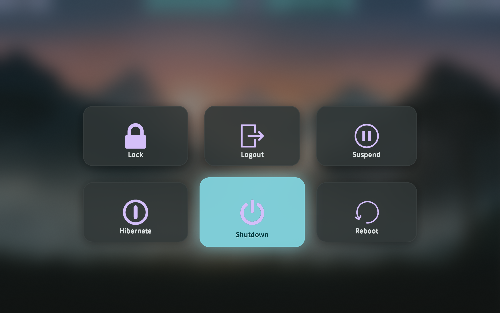
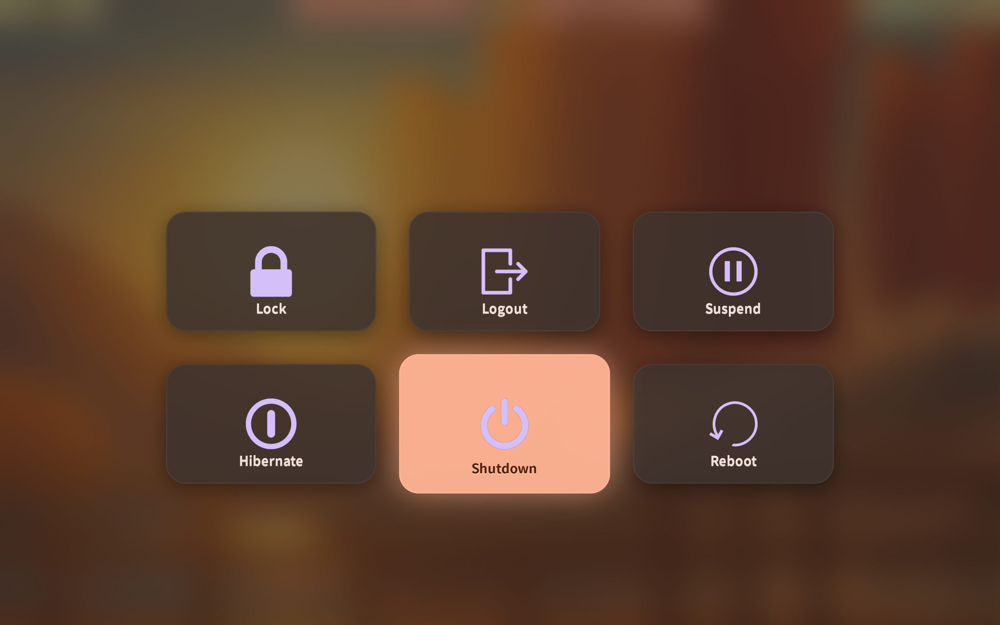
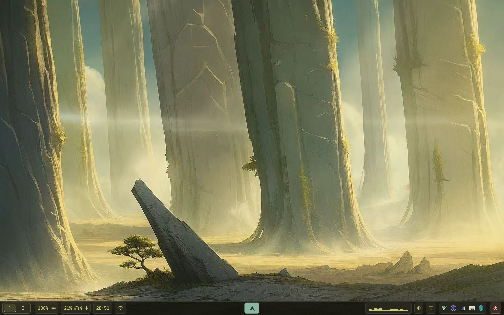
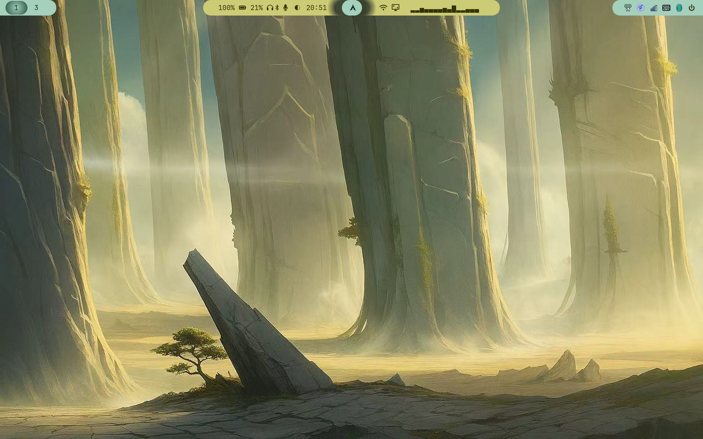

# My Arch Linux Dotfiles
Welcome to Horizon's archlinux repository, 
a place saving personal configuration of my operating system. 
Here's a brief overview of what you will find in the listing directory:

## Hyprland

`Hyprland` supports scrolling layouts. A shell script `toggle_layout.sh` can switch the layouts between `Dwindle` and `Scrolling` using keybinds(`super + D`). 


`screenshot.sh` is made for pasting screenshots in sessions.

`ghostty_cursors.sh` automatically closes(or start) the cursor trails in `ghostty` for reducing power consumption(or performance).

More keybinds can be found in `./hypr/hyprland.conf`.

The positioning of certain UI elements in `hyprlock` is hardcoded to my specific screen resolution. If you plan to use this, please manually adjust the coordinates of each component to fit your own display.

## "Hyper"hyprlock

hypr-prelock-animation is a `C` program makes a better visual transition before `hyprlock` kicks in. You can put all the animation files in `~/.config/hypr/lock_animation/`, then put the trigger script in `~/.config/hypr/scripts`, and add these in `~/.config/hypr/hyprland.conf`. 

```
bind = $mainMod ALT, L, exec, ~/.config/hypr/scripts/smart_lock.sh

windowrule {
    name = prelock-fullscreen
    match:class = ^(Smooth_Prelock)$
    fullscreen = true
}
```

## Matugen

`matugen` takes over multiple styling aspects, triggered dynamically via `waypaper`. Specifically, this covers: `waybar`, active window borders, `starship`, `mako`, `wlogout`, `fastfetch`, `btop`, Hypr-Prelock and `hyprlock`. 

New releases shows that `matugen` supports `base16` and pipes(`|`), some syntax has been superseded. Go to `waypaper/config.ini`, add `--source-color-index 0` behind `matugen image "$wallpaper"` may help to fix color issues.

## cowsay

"What does the cow say?"

## waybar

Check out my two `waybar` setup in `./waybar`. You can switch the `waybar` styles between `top` and `bottom` by using keybind `super + F1`. To reload `waybar`, use keybind `super + F2`.

## hyprsunset

Use keybind `super + F3` to turn down gamma, `super + F4` to turn the light down, `super + F5` to reload.

## Credits & Acknowledgements

This setup is built on the shoulders of giants. A huge thank you to the open-source community and the following creators for their amazing work and inspiration:

* **Rofi Themes:** The beautiful `Rofi` configuration used in this setup is entirely the work of [@anti1090x](https://github.com/adi1090x/rofi). I did not include it in my dotfiles to respect the original work—please visit their repository to grab the themes!
* **Wlogout:** Design and color palette heavily inspired by [Catppuccin](https://github.com/catppuccin/catppuccin).
* **Ghostty:** Terminal shaders and cursor effects are pulled from the awesome [ghostty-shaders](https://github.com/0xhckr/ghostty-shaders) and [cursor-effects](https://github.com/sahaj-b/ghostty-cursor-shaders) repository.

## Notice: Migration from Mako to SwayNC

If you've been following my previous setups, please note that I have recently migrated my notification daemon from `Mako` to `SwayNC`. 

* **Active:** The `swaync/` directory contains the current, actively themed configuration.
* **Deprecated:** The old `mako/` folder is left in the repository purely for legacy reference and is **no longer maintained**. Please use SwayNC moving forward!

## New scrolling long-screenshot added

To fix the longshot issue in `wanland`, I made a program in `C`, `bash` scripts and `Python`. It allows you to select an area which needs capturing. 
Then the program will stitch the recoeded video into a long `PNG` image. Check my repo `hypr-longshot` for details.

# Screenshots









