*Welcome to my GitHub repository, where I host some of my Archlinux and Hyprland configurations. Emmm and also this is my personal dotfiles, not a drop-in configuration. Hardware, locale, paths and dependencies are hard-coded. Do have a manual check if u wanna give a try ;)*

---

Here are stuffs I've selected for my laptop. 

* **Operating System:** Arch GNU/Linux
* **Window Manager:** Hyprland
* **Terminal Emulator:** Ghostty
* **Shell:** Fish
* **text editor:** Neovim
* **Status Bar:** Ironbar
* **Application Launcher:** walker


# Synchronization

`sync.sh` treats files already present in this checkout as the synchronization
allowlist. Top-level configuration entries map to `~/.config`; `home`,
`local/bin`, `scripts`, and `prelock` map explicitly to `~`, `~/.local/bin`,
`~/Projects/scripts`, and `~/.local/src/prelock`.

Run `./sync.sh --dry-run` before refreshing the checkout. A normal run copies
only allowlisted files whose contents changed, stages the resulting checkout,
creates a timestamped commit, and pushes the current branch to its configured
upstream. A rejected push leaves the commit local and never pulls or rebases
automatically. Generated application state, caches, credentials, private URLs,
machine identity, and build artifacts stay outside this repository.


# Individual/Collaborative Projects


## [Hypr-Prelock](./prelock)

Hypr-Prelock is a small C/Raylib transition layer that runs immediately before Hyprlock. It now provides five independently selectable animations: the original rotating padlock, counter-moving bars, a translucent diagonal sweep, a dual-vortex meteor field, and a liquid-glass membrane with real screen-space refraction.

> [!IMPORTANT]
> The Matugen templates in this repository target my custom build with an additional `contrary` palette and are not directly compatible with upstream Matugen. Prelock itself remains usable without Matugen: a missing palette automatically falls back to a monochrome theme. See the [Prelock compatibility and installation notes](./prelock/README.md).

The launcher selects an animation at random by default, accepts a specific style from the command line, and uses a private FIFO to start Hyprlock only after the selected animation reaches its final frame. The liquid mode captures the focused output through `grim` directly into memory, while Matugen supplies a shared semantic palette for every style.

The source is kept in `~/.local/src/prelock`; `make install` atomically deploys the executable to `~/.local/bin/prelock` and the liquid shader to `~/.local/share/prelock`:

```bash
cd ~/.local/src/prelock
make install
```

## [Hypr-Longshot](https://github.com/Horizon0427/hypr-longshot)

This is a lightweight, scrolling long-screenshot tool written in Python and based on `wf-recorder`. You can integrate it with components like Ironbar, mako, and copyq to easily capture and utilize long screenshots.

## MDR

*MDR is still under development and has not yet been uploaded to GitHub.*

This is a lightweight, fast, and single-purpose Markdown rendering tool. It simply renders a Markdown file locally. No background processes, no editing features, does not rely on a browser engine, and does not render mathematical formulas. It launches extremely quickly.

Simply double-click a Markdown file, and MDR will render it and open a window for you to read it. It’s that simple lol.

## [Hypr-Wallpicker](https://github.com/Unixcraft-Studios/hypr-wallpicker)

This is a lightweight wallpaper selector I designed, written in C. It features a freely arrangeable hexagonal UI.

I am collaborating with [GrandBIRDLizard](https://github.com/GrandBIRDLizard) on this project, aiming to create a tool that is fast, simple and clear in function, compatible with both Wayland and X11, and aligned with the UNIX philosophy.


# Self-configuration Based on Open-Source Tools


## Liquid Glass with Swirling Colors

Well... it doesn't really qualify as liquid glass, although that was my initial design goal, the final result looks more like a shimmering neon light.

When you hover your mouse over the buttons in the interfaces of the following two programs, you will notice the gradient colors on the buttons shift fluidly.

### Ironbar

I use Ironbar as my status bar because it is based on GTK4, allowing me to use advanced CSS syntax to create flowing colors and UI morphing effects.

### Walker

This is a GTK4-based application launch menu that allows for customizable layout and appearance.

## Matugen

This is a tool for calculating the dominant color of an image. I have integrated it into the wallpaper-switching process to dynamically adjust the system's theme color based on the output values.

Thanks to the [GTK folder templates and scripts](https://github.com/SHORiN-KiWATA/shorin-niri/tree/main/dotfiles/.config/matugen/templates/gtk-folder) created by [SHORiN-KiWATA](https://github.com/SHORiN-KiWATA), I was able to modify the color of the folder icons themselves.


# Gallary

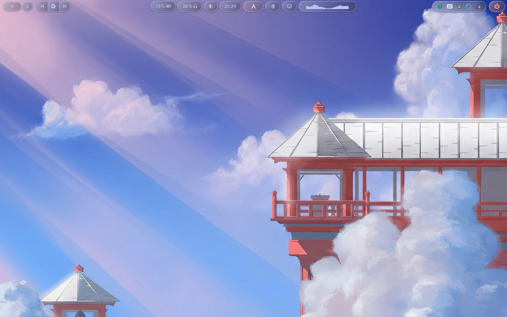

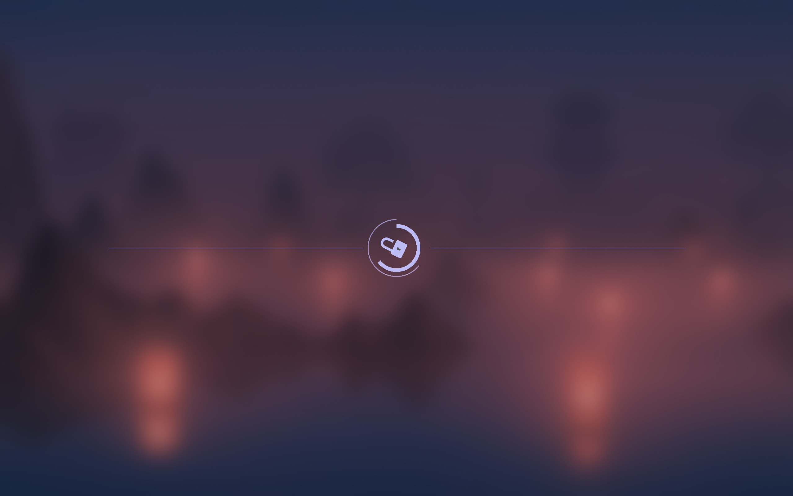

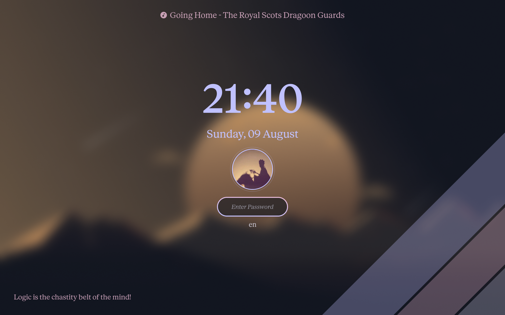

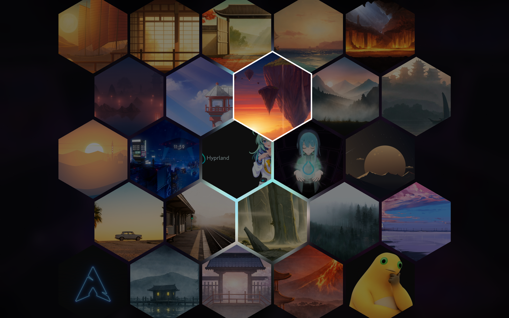

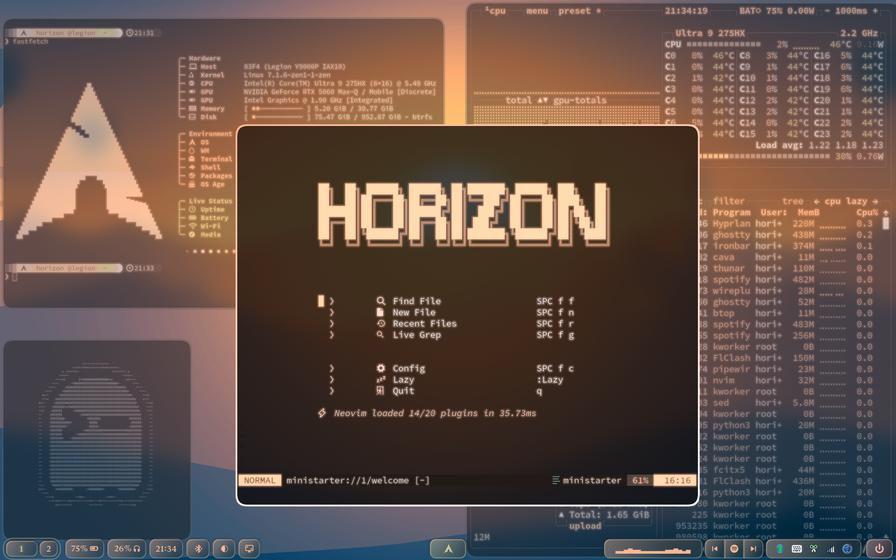

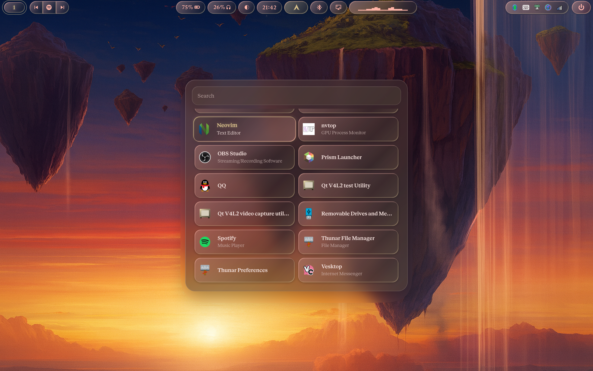

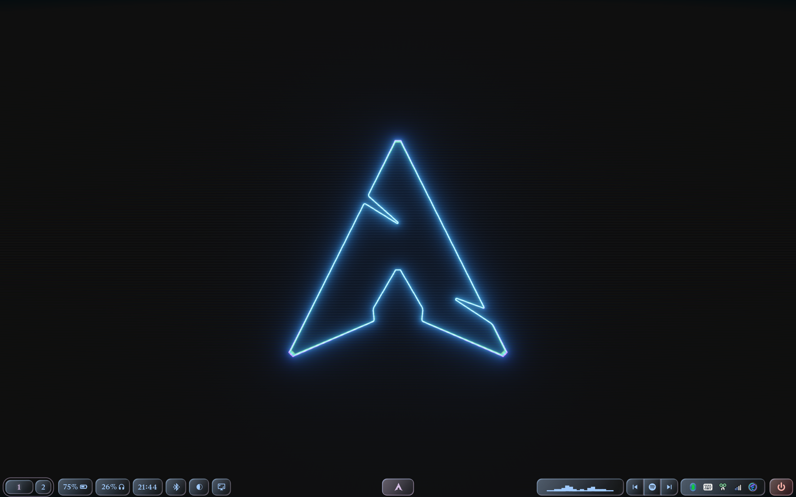

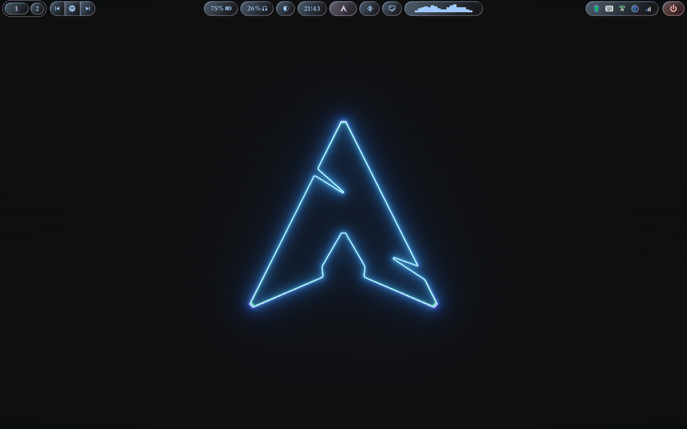

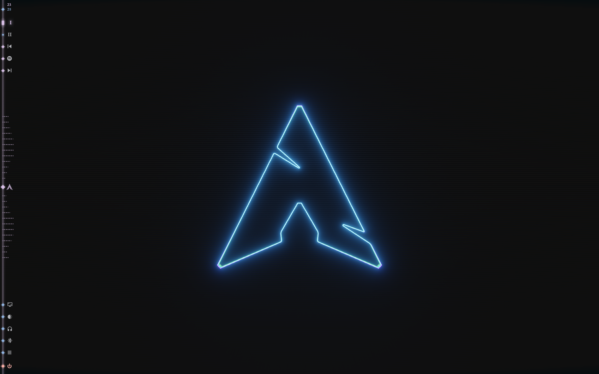

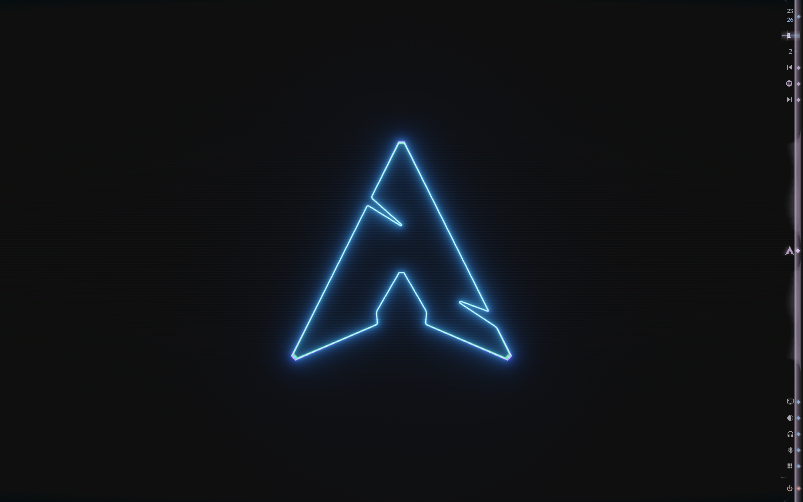

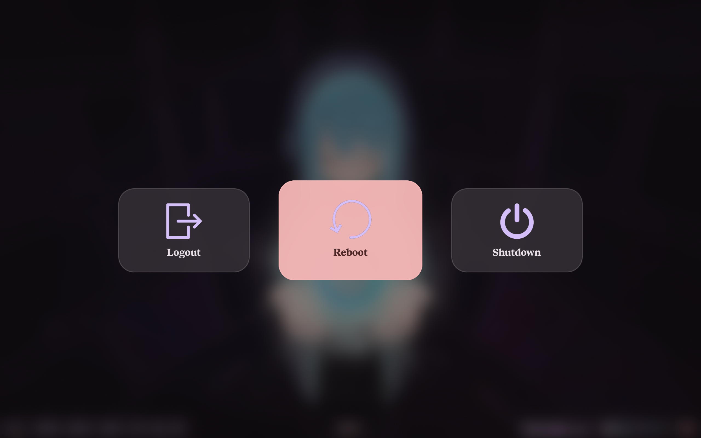
