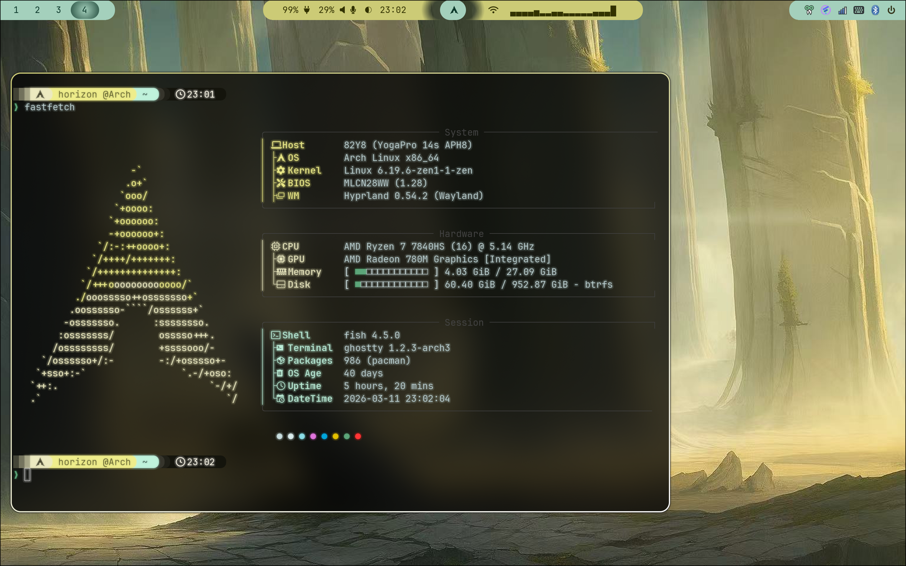
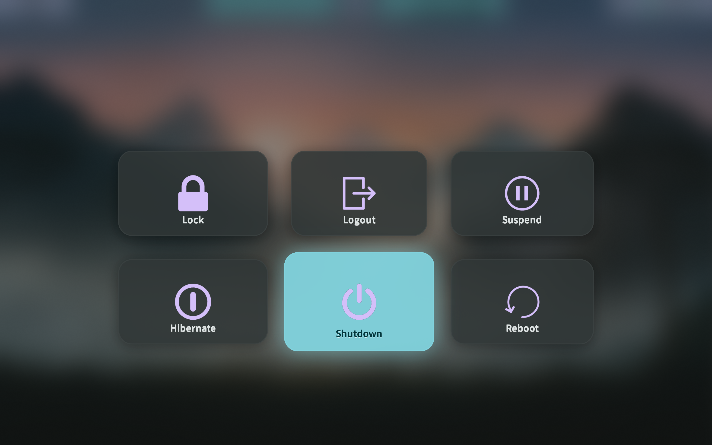
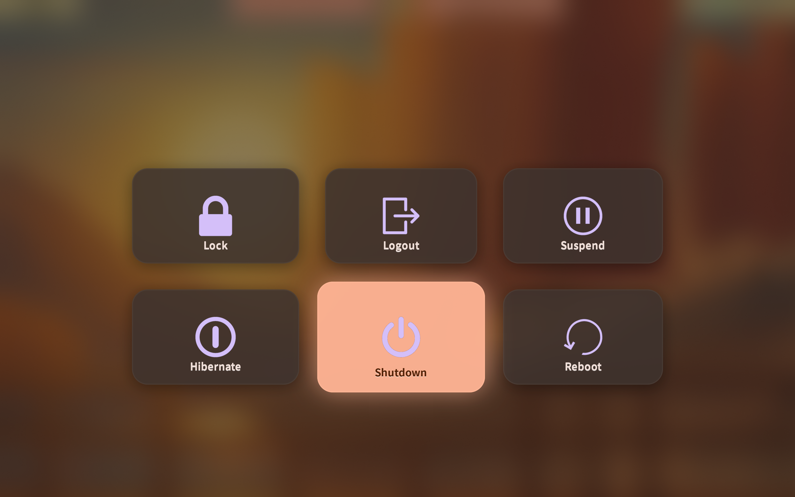
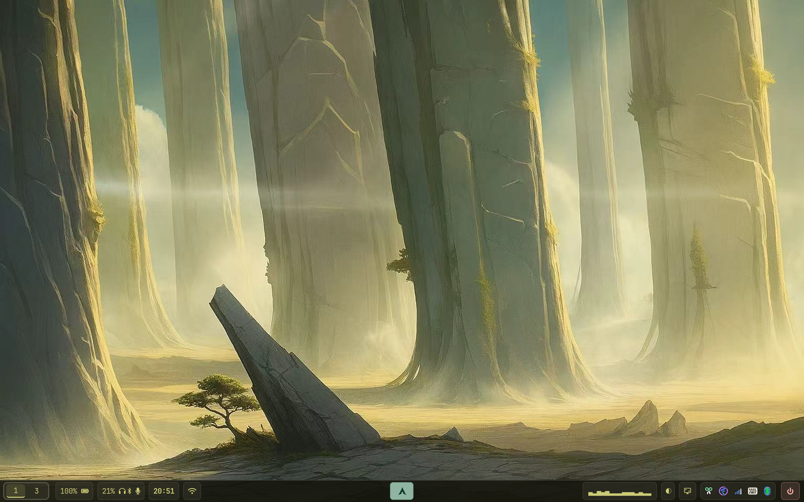
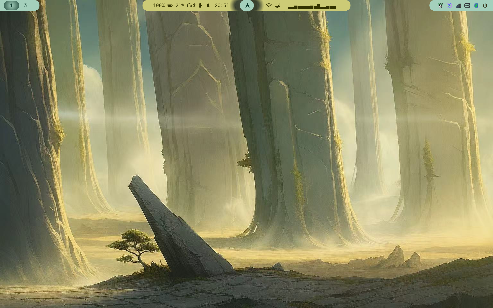

# My Arch Linux Dotfiles
Welcome to Horizon's archlinux repository, 
a place saving personal configuration of my operating system. 
Here's a brief overview of what you will find in the listing directory:

## Hyprland

`Hyprland` supports scrolling layouts. A shell script `toggle_layout.sh` can switch the layouts between `Dwindle` and `Scrolling` using keybinds(`super + D`). 


`screenshot.sh` is made for pasting screenshots in sessions.

`ghostty_cursors.sh` automatically closes(or start) the cursor trails in `ghostty` for reducing power consumption(or performance).

More keybinds can be found in `./hypr/hyprland.conf`.

The positioning of certain UI elements in `hyprlock` is hardcoded to my specific screen resolution. If you plan to use this, please manually adjust the coordinates of each component to fit your own display.

## "Hyper"hyprlock

hypr-prelock-animation is a `C` program makes a better visual transition before `hyprlock` kicks in. You can put all the animation files in `~/.config/hypr/lock_animation/`, then put the trigger script in `~/.config/hypr/scripts`, and add these in `~/.config/hypr/hyprland.conf`. 

```
bind = $mainMod ALT, L, exec, ~/.config/hypr/scripts/smart_lock.sh

windowrule {
    name = prelock-fullscreen
    match:class = ^(Smooth_Prelock)$
    fullscreen = true
}
```

Use `super + ALT + L` to lock your screen, and the spinning lock pattern animation will kick out before `hyprlock`.

## "Hyper"paperpicker

Yep I wrote another `C` program with COOL UI and smooth animation which allows you to select wallpapers, I also connected it with `matugen` 
so the theme color can change as well. I added scrolling logic, so now the wallpaper selector is able to handle an unlimited number of wallpapers. 

you can use `gcc main.c -lraylib -lm -o wallpicker` to compile it. 

The program actually ask `hyprland` for a window to display the patterns, so please add these in `~/.config/hypr/hyprland.conf`.

```
windowrule {
    name = wall-paper-picker
    match:class = ^(wallpicker)$
    fullscreen = true
    center = true
    no_blur = false    #if u don't like blur, turn it to "true". 
    stay_focused = true
    animation = slide
}
```

The program will read files via this default path: `~/Pictures/wallpapers`, make sure all the pictures are saved here. If you want to change the path, you can edit the source code and compile it again. 

For the first time you run the program, it will create the cache files of your high-res wallpapers, please just wait a second. Next time, it will start super quickly :)

**You also need to pay attention to this part in my `main.c`:**

```
if (IsMouseButtonReleased(MOUSE_BUTTON_LEFT)) {
    char full_target_path[1024];
    snprintf(full_target_path, sizeof(full_target_path), "%s/%s", wp_dir,
    wallpapers[hoveredIndex].filename);

    char cmd[2048];
    snprintf(cmd, sizeof(cmd),
        "("
        "awww img \"%s\" --transition-type any --transition-angl 30 "
        "--transition-step 30 --transition-duration 1.2 "
        "--transition-fps 60 & "
        "ln -sf \"%s\" $HOME/.config/hypr/current_wallpaper.png ; "
        "matugen image \"%s\" --source-color-index 0 ; "
        "makoctl reload ; "
        "hyprctl reload ; "
        "sleep 0.5 ; "
        "$HOME/.config/waybar/scripts/reload-waybar.sh "
        ") > /dev/null 2>&1 &",
        full_target_path, full_target_path, full_target_path
        );

        printf("执行系统联动命令: \n%s\n", cmd);
        system(cmd);
        break;
      }
```
This part runs commands to active `matugen` and change theme color based on current wallpaper, please check all code above to fit your own system. 

The whole process was really smooth so I simply gave up `waypaper`, now `waypaper` part is no longer maintained.

## Matugen

`matugen` takes over multiple styling aspects, triggered dynamically via my "Hyper"paperpicker. Specifically, this covers: `waybar`, active window borders, `starship`, `mako`, `wlogout`, `fastfetch`, `btop`, Hypr-Prelock & `hyprlock` and `yazi`. 


## cowsay

"What does the cow say?"

## waybar

Check out my two `waybar` setup in `./waybar`. You can switch the `waybar` styles between `top` and `bottom` by using keybind `super + F1`. To reload `waybar`, use keybind `super + F2`.

## hyprsunset

Use keybind `super + F3` to turn down gamma, `super + F4` to turn the light down, `super + F5` to reload.

## Credits & Acknowledgements

This setup is built on the shoulders of giants. A huge thank you to the open-source community and the following creators for their amazing work and inspiration:

* **Rofi Themes:** The beautiful `Rofi` configuration used in this setup is entirely the work of [@anti1090x](https://github.com/adi1090x/rofi). I did not include it in my dotfiles to respect the original work—please visit their repository to grab the themes!
* **Wlogout:** Design and color palette heavily inspired by [Catppuccin](https://github.com/catppuccin/catppuccin).
* **Ghostty:** Terminal shaders and cursor effects are pulled from the awesome [ghostty-shaders](https://github.com/0xhckr/ghostty-shaders) and [cursor-effects](https://github.com/sahaj-b/ghostty-cursor-shaders) repository.

## Notice: Migration from SwayNC to Mako

Yep previously I gave up `mako` and tried `swaync`. But I cannot come up with ANY idea about what should be placed there... 
So I came back, `swaync` is no longer maintained... Sorry :)

## New scrolling long-screenshot added

To fix the longshot issue in `wanland`, I made a program in `C`, `bash` scripts and `Python`. It allows you to select an area which needs capturing. 
Then the program will stitch the recoeded video into a long `PNG` image. Check my repo `hypr-longshot` for details.

# Screenshots













