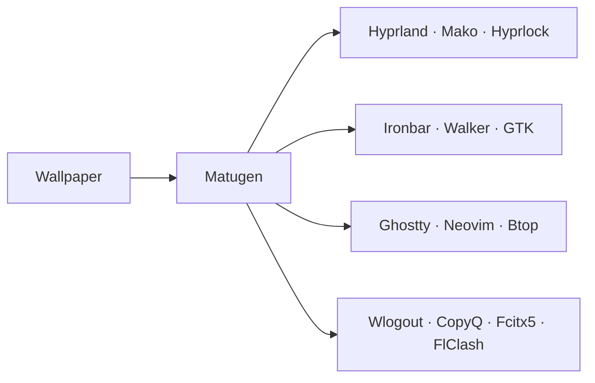

<div align="center">

# Horizon's Arch Linux Dotfiles

**A wallpaper-driven Hyprland rice with fluid motion, glassy surfaces, and one color palette across the desktop.**


</div>

## At a glance

| | Component | Choice |
| --- | --- | --- |
| 🐧 | Distribution | Arch Linux |
| 🪟 | Compositor | Hyprland on Wayland, configured in Lua |
| 🧊 | Status bar | Ironbar with top and bottom layouts |
| 🚀 | Launcher | Walker |
| 👻 | Terminal | Ghostty + custom shaders |
| 🎨 | Colors | Matugen / Material You |
| 🔔 | Notifications | Mako |
| 🔒 | Lock screen | Hyprlock + custom Raylib pre-lock animation |
| ✏️ | Editor | Neovim |
| 🐚 | Shell | Fish + Starship |

## Highlights

- **One wallpaper, one desktop palette.** Matugen recolors Hyprland, Ironbar, Walker, Ghostty, Neovim, GTK, Mako, Btop, Wlogout, CopyQ, Fcitx5, FlClash, and more.
- **Liquid-glass Ironbar.** Two layouts, interactive modules, a Cava visualizer, and smooth CSS transitions share the same generated palette.
- **Lua-first Hyprland.** The configuration is split into focused modules for monitors, input, rules, keybinds, scrolling, appearance, and animations.
- **A terminal with a little drama.** Ghostty combines transparency, bloom, and a cursor-warp shader while still following the current Matugen colors.
- **Live Neovim recoloring.** A custom TokyoNight bridge watches Matugen's generated palette and refreshes Neovim without a restart.
- **Small tools for the missing pieces.** Wallpaper picking, pre-lock motion, screenshots, and bar control are wired directly into the desktop workflow.

## Wallpaper-to-desktop color flow


```mermaid
flowchart LR
    W["Wallpaper"] --> M["Matugen"]
    M --> C1["Hyprland · Mako · Hyprlock"]
    M --> C2["Ironbar · Walker · GTK"]
    M --> C3["Ghostty · Neovim · Btop"]
    M --> C4["Wlogout · CopyQ · Fcitx5 · FlClash"]
```

Changing the wallpaper is enough to regenerate the palette. Post-hooks reload the components that need it; Neovim watches its generated palette and updates in place.

## Repository tour

| Path | What lives there |
| --- | --- |
| [`hypr/`](./hypr/) | Modular Lua config, rules, keybinds, animations, Hyprlock, Hypridle, and helper scripts |
| [`ironbar/`](./ironbar/) | Top/bottom layouts, liquid-glass CSS, and interactive module scripts |
| [`matugen/`](./matugen/) | The central template and reload pipeline for the desktop palette |
| [`ghostty/`](./ghostty/) | Terminal settings, generated colors, bloom, and cursor shaders |
| [`nvim/`](./nvim/) | Lua-based editor config with live Matugen/TokyoNight integration |
| [`walker/`](./walker/) | GTK4 launcher layout and theme |
| [`gtk-3.0/`](./gtk-3.0/) · [`gtk-4.0/`](./gtk-4.0/) | GTK styling and generated color surfaces |
| [`btop/`](./btop/) · [`mako/`](./mako/) · [`wlogout/`](./wlogout/) | System UI pieces tied into the same visual language |
| [`yazi/`](./yazi/) · [`zathura/`](./zathura/) · [`copyq/`](./copyq/) | Themed utilities |
| [`starship.toml`](./starship.toml) | Shell prompt styling |

## Favorite keybinds

`SUPER` is the main modifier.

| Key | Action |
| --- | --- |
| `SUPER + Q` | Open Ghostty |
| `SUPER + E` | Open Thunar |
| `SUPER + R` | Open Walker |
| `SUPER + Z` | Open the wallpaper picker |
| `SUPER + D` | Toggle the window layout |
| `SUPER + T` | Toggle animations |
| `SUPER + F1` | Move Ironbar between the top and bottom |
| `SUPER + F2` | Reload Ironbar |
| `SUPER + ALT + L` | Run the pre-lock animation and lock |
| `SUPER + SHIFT + S` | Open the screenshot workflow |

The complete set lives in [`hypr/configuration/keybinds.lua`](./hypr/configuration/keybinds.lua).

## Using these dotfiles

This is a **personal configuration snapshot**, not a turn-key installer. Some files contain machine-specific paths, monitor assumptions, locally built tools, or version-sensitive Hyprland options. Treat the repository as a reference and copy only the pieces you understand.

```bash
git clone https://github.com/Horizon0427/Arch-Config.git
cd Arch-Config
```

Review a component and its dependencies before placing it under `~/.config/`. In particular, the Lua-based Hyprland setup and custom tools may require newer builds or local paths that differ from yours.

> [!CAUTION]
> [`sync.sh`](./sync.sh) is my **repository maintenance script**, not an installation script. `./sync.sh --dry-run` only previews allowlisted updates from `~/.config`; running it without `--dry-run` may create a commit and push it to the configured remote.

## Side projects

### [Hypr-Wallpicker](https://github.com/Horizon0427/hypr-wallpicker)

A fast wallpaper selector written in C with [raylib](https://www.raylib.com/), integrated with the Matugen workflow.

### Hypr-Prelock

A small Raylib animation that eases into Hyprlock. Its source and launcher live in [`hypr/lock_animation/`](./hypr/lock_animation/) and [`hypr/scripts/smart_lock.sh`](./hypr/scripts/smart_lock.sh).

### [Hypr-Longshot](https://github.com/Horizon0427/hypr-longshot)

A scrolling-screenshot tool for Hyprland, built with Python/OpenCV and C/raylib and exposed through the Ironbar workflow.

## Credits

- [SHORiN-KiWATA's Matugen GTK folder templates](https://github.com/SHORiN-KiWATA/shorin-niri/tree/main/dotfiles/.config/matugen/templates/gtk-folder) inspired the dynamic Thunar folder icons.
- [raylib](https://www.raylib.com/) powers the small native visual tools in this setup.

## License

Released under the [MIT License](./LICENSE).
